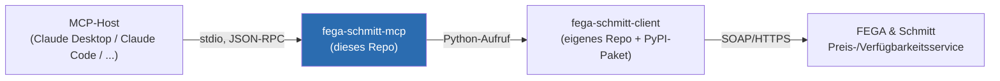

# fega-schmitt-mcp

> **Status: Konzeptphase.** Dieses Repository enthält aktuell nur Dokumentation (README + Architekturbeschreibung). Es ist noch kein Code implementiert.

Ein geplanter, **dünner** [MCP](https://modelcontextprotocol.io)-Server, der KI-Assistenten (z. B. Claude) Zugriff auf Daten von **FEGA & Schmitt Elektrogroßhandel** gibt — in erster Linie Preis- und Verfügbarkeitsabfragen für Artikel.

Die gesamte Protokoll-/API-Logik (SOAP, Auth, Fehlercodes, XML) lebt **nicht** in diesem Repo, sondern in der eigenständigen Python-Library [`fega-schmitt-client`](../../Python/fega-schmitt-client) (Repo unter `GIT/Python/`). Dieses Repo bildet nur die Brücke zwischen MCP-Protokoll und dieser Library.



## Warum zwei Pakete?

- **`fega-schmitt-client`**: reine Python-Library, kein MCP-/KI-spezifischer Code. Eigenständig nutzbar (Skripte, andere Services), unabhängig testbar, unabhängig versionierbar.
- **`fega-schmitt-mcp`** (dieses Repo): übersetzt die Library-Funktionen in MCP-Tools (stdio-Transport, Tool-Schemas, Fehler-Serialisierung für MCP-Clients). Enthält selbst keine SOAP-/XML-Logik.

Beide Pakete werden auf [PyPI](https://pypi.org/) veröffentlicht, sodass `fega-schmitt-mcp` regulär per `pip install` / `uvx` installierbar ist und `fega-schmitt-client` unabhängig davon in anderen Projekten nutzbar bleibt.

## Über FEGA & Schmitt

FEGA & Schmitt ist ein deutscher Elektrogroßhändler. Details zu den verfügbaren Schnittstellen (SOAP-Preisservice, IDS-Branchenstandard, UGL4-Branchenstandard) und warum aktuell nur der SOAP-Preisservice angebunden wird, siehe die Architekturbeschreibung der Library: [`fega-schmitt-client`/docs/architecture.md](../../Python/fega-schmitt-client/docs/architecture.md). Die Original-Spezifikations-PDFs liegen dort unter `docs/specs/`.

## Geplanter Funktionsumfang (v1)

Ein MCP-Tool zur Preis-/Verfügbarkeitsabfrage, das `fega_schmitt_client.FegaSchmittClient.get_price_availability(...)` aufruft:

- Eingabe: Liste von Artikelnummern (FEGA & Schmitt-Artikelnummer) mit Menge und optionaler Mengeneinheit
- Ausgabe je Artikel: Verfügbarkeitsstatus (voll verfügbar / Teilmenge / nicht verfügbar / Beschaffung), Nettopreis, Listenpreis, Zu-/Abschläge, Lagerzuordnung
- Fehlerfälle (unbekannte Artikelnummer, ungültige Mengeneinheit, Mengenüberlauf) werden je Position gemeldet, ohne die gesamte Anfrage abzubrechen

Details zu Architektur und Datenfluss: siehe [docs/architecture.md](docs/architecture.md).

## Geplante Installation

```bash
pip install fega-schmitt-mcp
```

(Noch nicht veröffentlicht.)

## Offene Punkte

- Test-/Produktivzugangsdaten für den SOAP-Service (siehe `fega-schmitt-client`-Repo)
- Wie Zugangsdaten dem MCP-Server übergeben werden (Umgebungsvariablen vs. MCP-Client-Konfiguration)
- Zielumgebung des MCP-Servers (lokal per stdio, oder als gehosteter Dienst?)
- Endgültiger PyPI-/Paketname (`fega-schmitt-mcp` ist ein Arbeitstitel)

## Lizenz

MIT, siehe [LICENSE](LICENSE).
