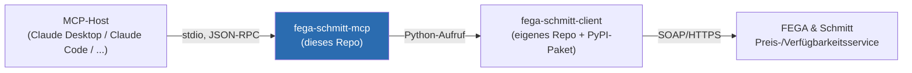

# fega-schmitt-mcp

[](https://github.com/the78mole/fega-schmitt-mcp/actions/workflows/publish.yml)
[](LICENSE)
[](https://github.com/astral-sh/uv)
[](https://github.com/astral-sh/ruff)

> **Status: v1 implementiert** (Preis-/Verfügbarkeitsabfrage), noch nicht auf PyPI veröffentlicht.

Ein **dünner** [MCP](https://modelcontextprotocol.io)-Server, der KI-Assistenten (z. B. Claude)
Zugriff auf Daten von **FEGA & Schmitt Elektrogroßhandel** gibt — Preis- und
Verfügbarkeitsabfragen für Artikel.

Die gesamte Protokoll-/API-Logik (SOAP, Auth, Fehlercodes, XML) lebt **nicht** in diesem Repo,
sondern in der eigenständigen Python-Library
[`fega-schmitt-client`](https://github.com/the78mole/fega-schmitt-client)
(Repo unter `GIT/Python/`, auf [PyPI](https://pypi.org/project/fega-schmitt-client/) veröffentlicht).
Dieses Repo bildet nur die Brücke zwischen MCP-Protokoll und dieser Library.



> **Suchst du die Python-Library oder das CLI-Tool?**
> Siehe [`fega-schmitt-client`](https://github.com/the78mole/fega-schmitt-client) — die
> eigenständige Library, die dieser MCP-Server verpackt.

## Warum zwei Pakete?

- **`fega-schmitt-client`**: reine Python-Library, kein MCP-/KI-spezifischer Code. Eigenständig
  nutzbar (Skripte, andere Services), unabhängig testbar, unabhängig versionierbar.
- **`fega-schmitt-mcp`** (dieses Repo): übersetzt die Library-Funktionen in MCP-Tools
  (stdio-Transport, Tool-Schemas, Fehler-Serialisierung für MCP-Clients). Enthält selbst keine
  SOAP-/XML-Logik.

## Tools

| Tool | Beschreibung |
|------|-------------|
| `get_price_availability` | Preis und Verfügbarkeit für bis zu 999 Artikel je Anfrage. Eingabe: Liste von Artikelnummern mit Menge und optionaler Mengeneinheit. Ausgabe je Artikel: Verfügbarkeitsstatus, Nettopreis, Listenpreis, Zu-/Abschläge, Lagerzuordnung. Fehlerfälle (unbekannte Artikelnummer, ungültige Mengeneinheit, Mengenüberlauf) werden je Position gemeldet, ohne die gesamte Anfrage abzubrechen. |

## Installation

### Voraussetzungen

- Python ≥ 3.10
- [uv](https://docs.astral.sh/uv/)

### Dependencies installieren

```bash
uv sync
```

### Server starten (Entwicklung)

```bash
export FEGA_CUSTOMER_NUMBER=9920
export FEGA_SHOP_PASSWORD=...
uv run fega-schmitt-mcp
# oder
uv run python -m fega_schmitt_mcp.server
```

### Mit dem MCP Inspector testen

```bash
uv run mcp dev src/fega_schmitt_mcp/server.py
```

## Konfiguration in VS Code / Claude Desktop

Server in der MCP-Konfiguration eintragen (`.vscode/mcp.json` bzw. `claude_desktop_config.json`):

**Installation von PyPI:**

```json
{
  "servers": {
    "fega-schmitt": {
      "command": "bash",
      "args": ["-l", "-c", "uvx fega-schmitt-mcp"],
      "env": {
        "FEGA_CUSTOMER_NUMBER": "9920",
        "FEGA_SHOP_PASSWORD": "..."
      }
    }
  }
}
```

**Installation von GitHub:**

```json
{
  "servers": {
    "fega-schmitt": {
      "command": "bash",
      "args": [
        "-l",
        "-c",
        "uvx --from git+https://github.com/the78mole/fega-schmitt-mcp.git fega-schmitt-mcp"
      ],
      "env": {
        "FEGA_CUSTOMER_NUMBER": "9920",
        "FEGA_SHOP_PASSWORD": "..."
      }
    }
  }
}
```

**Lokale Entwicklung (Workspace-Checkout):**

```json
{
  "servers": {
    "fega-schmitt": {
      "command": "bash",
      "args": ["-l", "-c", "uv --directory ${workspaceFolder} run fega-schmitt-mcp"],
      "env": {
        "FEGA_CUSTOMER_NUMBER": "9920",
        "FEGA_SHOP_PASSWORD": "..."
      }
    }
  }
}
```

> **Hinweis:** `bash -l` lädt das Login-Shell-Profil, damit `uvx`/`uv` in `~/.local/bin` gefunden
> werden, ohne dass eine zusätzliche `env`/`PATH`-Konfiguration nötig ist.

## Umgebungsvariablen

| Variable | Default | Beschreibung |
|----------|---------|--------------|
| `FEGA_CUSTOMER_NUMBER` | – (erforderlich) | FEGA & Schmitt-Kundennummer (`PARTNER_PURCHASER`) |
| `FEGA_SHOP_PASSWORD` | – (erforderlich) | Shop-Kennwort (`LEGITIMATION_ID`) |
| `FEGA_ENDPOINT` | `https://soap.fega.de/priceavail.php` | Abweichende Service-URL, z. B. für Tests gegen einen Mock-Server |
| `FEGA_TIMEOUT` | `30` | HTTP-Timeout in Sekunden |

Fehlen `FEGA_CUSTOMER_NUMBER`/`FEGA_SHOP_PASSWORD`, liefert das Tool `{"error": ...}` statt eine
Exception zu werfen — Secrets werden nie geloggt oder im Code hinterlegt (siehe
[docs/architecture.md](docs/architecture.md), Abschnitt 3).

## Beispiel

```text
get_price_availability(items=[
    {"material_number": "0815", "quantity": "200", "unit": "MTR"},
    {"material_number": "4711"},
])
```

liefert:

```json
{
  "results": [
    {
      "line_item_number": 1,
      "material_number": "0815",
      "status": "ok",
      "return_code": "I720",
      "return_code_text": "OK",
      "availability_status": "V",
      "warehouse_number": "10",
      "warehouse_name": "Zentrallager",
      "price_amount": "12.50",
      "net_amount": "13.20",
      "list_amount": "15.00",
      "surcharges": [{"code": "CU", "text": "Kupferzuschlag", "amount": "0.70"}]
    },
    {
      "line_item_number": 2,
      "material_number": "4711",
      "status": "error",
      "return_code": "E999",
      "return_code_text": "Bitte pruefen Sie Ihre Anmeldedaten",
      "availability_status": null,
      "warehouse_number": null,
      "warehouse_name": null,
      "price_amount": null,
      "net_amount": null,
      "list_amount": null,
      "surcharges": []
    }
  ]
}
```

## Über FEGA & Schmitt

FEGA & Schmitt ist ein deutscher Elektrogroßhändler. Details zu den verfügbaren Schnittstellen
(SOAP-Preisservice, IDS-Branchenstandard, UGL4-Branchenstandard) und warum aktuell nur der
SOAP-Preisservice angebunden wird, siehe die Architekturbeschreibung der Library:
[`fega-schmitt-client`/docs/architecture.md](https://github.com/the78mole/fega-schmitt-client/blob/main/docs/architecture.md).

## Lokale Entwicklung

```bash
# Projektumgebung einrichten
uv sync

# Linting & Formatting
uv run ruff format .
uv run ruff check --fix .

# Tests
uv run pytest
```

## Offene Punkte

- Test-/Produktivzugangsdaten für den SOAP-Service (siehe `fega-schmitt-client`-Repo)
- Zielumgebung des MCP-Servers (lokal per stdio, oder als gehosteter Dienst?)
- Endgültiger PyPI-/Paketname (`fega-schmitt-mcp` ist ein Arbeitstitel)
- PyPI Trusted Publishing muss einmalig manuell auf pypi.org eingerichtet werden (Workflow-Datei
  `publish.yml`, Environment `pypi`), bevor der Release-Workflow tatsächlich veröffentlichen kann

## Related Projects

| Project | Description |
|---------|-------------|
| [fega-schmitt-client](https://github.com/the78mole/fega-schmitt-client) | Python-Library, die dieser MCP-Server verpackt. Enthält die gesamte SOAP-/Protokoll-Logik sowie ein eigenständiges CLI. |

## Lizenz

MIT, siehe [LICENSE](LICENSE).
