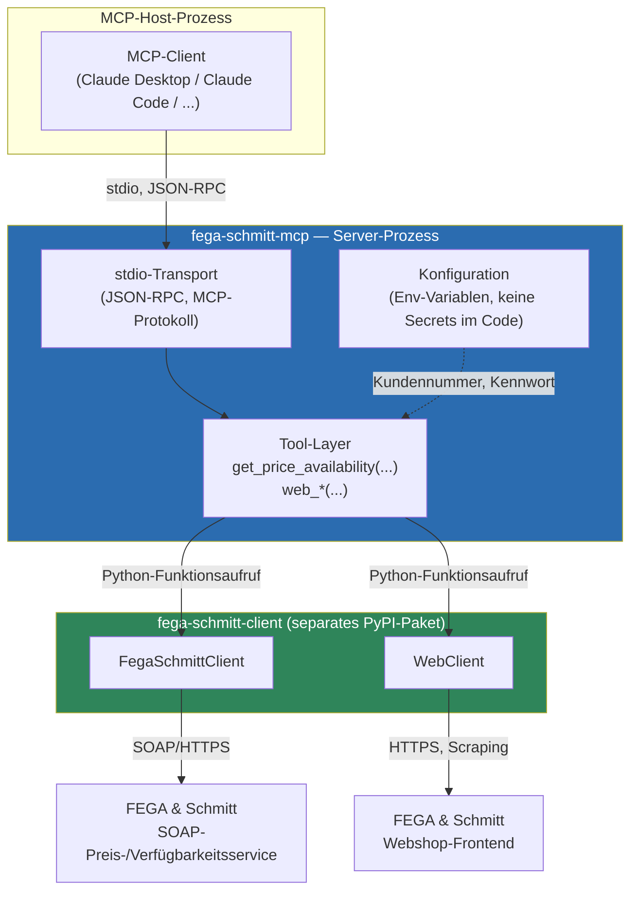
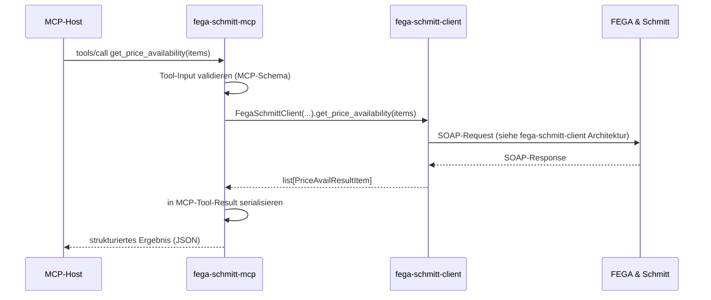
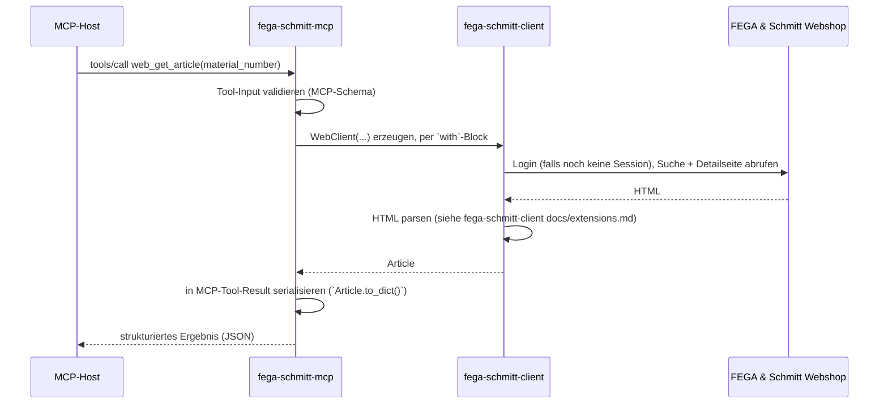

# Architektur

> Preis-/Verfügbarkeitsabfrage (`get_price_availability`, über die SOAP-Schnittstelle) sowie
> Webshop-Zugriff (`web_*`-Tools, über das gescrapte Webshop-Frontend) implementiert.

## 1. Zuschnitt dieses Repos

`fega-schmitt-mcp` ist bewusst dünn gehalten: Es kennt das MCP-Protokoll (Tools, Schemas, stdio-Transport) und übersetzt Tool-Aufrufe in Aufrufe der Library [`fega-schmitt-client`](../../../Python/fega-schmitt-client). Alles, was FEGA & Schmitt-Protokolldetails betrifft (SOAP, Auth, XML, Returncodes, Datenmodell, Webshop-Scraping), lebt dort — siehe [dessen Architekturbeschreibung](../../../Python/fega-schmitt-client/docs/architecture.md).

Der Server ist zustandslos: jeder Tool-Aufruf entspricht 1:1 einem Aufruf der Library (für die `web_*`-Tools: ein neuer `WebClient` pro Aufruf, per `with`-Block wieder geschlossen). Es wird kein lokaler Datenbestand gehalten (keine Artikelstammdaten, kein Preis-Cache).

## 2. Ablauf `get_price_availability` (SOAP-Tool-Sicht)

Die eigentliche Request-/Response-Logik, das Fehler-/Returncode-Mapping und das Datenmodell sind in der [Architekturbeschreibung von `fega-schmitt-client`](../../../Python/fega-schmitt-client/docs/architecture.md) dokumentiert (Abschnitte 3–5) und werden hier nicht dupliziert.

## 2.1 Ablauf eines `web_*`-Tools (Webshop-Tool-Sicht)

Anders als bei `get_price_availability` ist die Antwort hier das Ergebnis eines HTML-Parsers gegen eine nicht offiziell dokumentierte Weboberfläche, kein XML-Response gegen eine dokumentierte Schnittstelle — daher potenziell instabiler gegenüber Änderungen bei FEGA & Schmitt. Details je Methode: [`fega-schmitt-client`/docs/extensions.md](../../../Python/fega-schmitt-client/docs/extensions.md).

## 3. Aufgabe dieses Repos im Detail

- **MCP-Tool-Definition**: Name, Beschreibung, Input-/Output-Schema für `get_price_availability` und die `web_*`-Tools
- **Konfiguration/Secrets**: Einlesen von Zugangsdaten (Kundennummer, Shop-Kennwort, gemeinsam für beide Backends) aus Umgebungsvariablen oder MCP-Client-Konfiguration und Weiterreichen an `FegaSchmittClient`/`WebClient` — die Library selbst liest keine Umgebungsvariablen (siehe deren Architektur, Abschnitt 6)
- **Fehler-Serialisierung**: Exceptions aus `fega-schmitt-client` (`FegaTransportError`, `FegaAuthError`, `FegaLoginError`, `FegaScrapingError`) in MCP-konforme Fehlerantworten übersetzen; Positions-Fehler (`status = "error"` je Artikel) werden als Teil des normalen Tool-Ergebnisses zurückgegeben, nicht als MCP-Fehler
- **Kein** eigenes SOAP-/XML-Handling, kein eigenes HTML-Parsing, keine eigene Kopie der FEGA & Schmitt-Spezifikationen (siehe [`fega-schmitt-client`/docs/specs/](../../../Python/fega-schmitt-client/docs/specs/) bzw. [docs/extensions.md](../../../Python/fega-schmitt-client/docs/extensions.md))

## 4. Technologiewahl

- **MCP-Framework:** FastMCP (`mcp[cli]`, offizielles Python-SDK)
- **Paketverwaltung:** `uv`, Linting/Formatting mit `ruff`
- **Abhängigkeit:** `fega-schmitt-client` als reguläre PyPI-Dependency (kein Vendoring, kein Git-Submodule); während der lokalen Entwicklung per `[tool.uv.sources]`-Pfad-Override auf den Checkout unter `GIT/Python/fega-schmitt-client` umgeleitet, im Release-Workflow entfernt
- **Tests:** `pytest`, mit gemockten `FegaSchmittClient`/`WebClient` (`_build_client`/`_build_web_client` werden gepatcht), damit Server-Tests keine echte SOAP-Verbindung oder HTTP-Requests gegen den Webshop benötigen
- **Veröffentlichung:** PyPI, via Trusted Publishing (GitHub Actions)

## 5. Warum IDS und UGL4 hier ohnehin kein Thema sind

Beide Schnittstellen sind kein Request/Response-Muster (Browser-Redirect-Flow bzw. Batch-Datei-Austausch, siehe [`fega-schmitt-client`/docs/architecture.md](../../../Python/fega-schmitt-client/docs/architecture.md), Abschnitt 7). Sollten sie später als Erweiterung der Library folgen, würde dieses Repo lediglich ein weiteres, dünnes Tool ergänzen, das die dann in `fega-schmitt-client.ids` / `fega-schmitt-client.ugl4` liegende Funktion aufruft — die architektonische Rolle dieses Repos (dünner MCP-Wrapper, keine Protokolllogik) ändert sich dadurch nicht. Das `web`-Submodul (Abschnitt 2.1) folgt demselben Muster: Es ist eine dritte, ebenfalls dünn angebundene Datenquelle der Library, kein eigenes Protokoll in diesem Repo.

## 6. Offene Fragen

Siehe README, Abschnitt "Offene Punkte".
